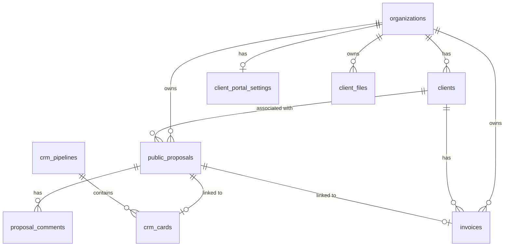

# Client Portal Implementation Plan

**Created:** December 2025
**Status:** Planning Phase
**Priority:** High (Pro/Enterprise Tier Feature)

---

## Executive Summary

The Client Portal transforms PAIDS from a document generation tool into a comprehensive client engagement platform. This feature will enable agencies to provide a PandaDoc/DocuSign-like experience for their clients while maintaining full data ownership and AI-powered workflows.

**Current State:**
- Basic public proposal sharing exists (`/p/:id`)
- Digital signature with CRM integration
- Multi-tenant organization support
- No comments, no client accounts, no dashboard

**Target State:**
- Beautiful, branded client-facing portal
- Comment & collaboration features
- Client authentication (magic links)
- Full dashboard with proposals, agreements, invoices
- White-label and custom domain support

---

## Current Infrastructure Assessment

### Database Models (Existing)

**public_proposals** (server/prisma/schema.prisma:638-658)
```prisma
- id: String (UUID)
- workspaceId: Int
- htmlContent: String
- status: String (active/signed/expired/revoked)
- password: String?
- expiresAt: DateTime?
- signatures: String? (JSON)
- viewCount: Int
- pipelineId: Int?
- crmCardId: Int?
```

**crm_pipelines** (server/prisma/schema.prisma:533-556)
```prisma
- id, name, description, type
- stages: String (JSON array)
- userId, workspaceId, organizationId
```

**crm_cards** (server/prisma/schema.prisma:558-590)
```prisma
- pipelineId, stage, position
- title, name, email, phone, company
- notes, metadata
- proposalId: String?
```

### APIs (Existing)

| Endpoint | Method | Description |
|----------|---------|-------------|
| `/workspace/:slug/proposals` | POST | Create public proposal |
| `/proposal/:id` | GET | Get proposal (public) |
| `/proposal/:id/sign` | POST | Sign proposal |

### Frontend (Existing)

- `PublicProposal/index.jsx` - Basic proposal viewer with sign modal
- `ShareProposalModal/index.jsx` - Create share links from chat
- Basic branding (workspace logo, name)

---

## Feature Breakdown by Phase

### Phase 1: Enhanced Public Proposals (Quick Win - Pro Tier)

**Goal:** Polish current public proposals into a professional client experience.

**Features:**
- Clean, mobile-responsive design
- Workspace branding (logo, colors)
- View counter + last seen timestamp
- Comment section
- One-click "Approve" button (separate from sign)
- Download branded PDF
- Expiry date display
- Password protection UI

**New Database Fields:**
```prisma
model public_proposals {
  // ... existing fields
  lastViewedAt      DateTime?
  clientName         String?
  clientEmail         String?
}

model proposal_comments {
  id            Int      @id @default(autoincrement())
  proposalId    String
  authorName    String
  authorEmail   String?
  isFromClient  Boolean  @default(true)
  content       String
  createdAt     DateTime @default(now())

  @@index([proposalId])
}
```

**New APIs:**
- `PATCH /proposal/:id/view` - Track view with timestamp
- `GET /proposal/:id/comments` - Get comments
- `POST /proposal/:id/comments` - Add comment
- `POST /proposal/:id/approve` - Approve (not sign)

**Frontend Changes:**
- Redesign `PublicProposal/index.jsx` with modern UI
- Add comment component
- Add "Approve" button alongside "Sign"
- Improve PDF download with backend generation
- Add last seen tracker (heartbeat)

---

### Phase 2: Full Client Portal Dashboard (Pro/Enterprise)

**Goal:** Dedicated client portal with all client-facing content.

**Features:**
- Per-client portal link (magic link)
- Sections:
  - Active Proposals
  - Signed Agreements
  - Invoices & Payment Status
  - Project Timeline/Next Steps
  - Files & Resources
  - Live Chat (connects to PAIDS thread)

**New Database Models:**
```prisma
model clients {
  id             Int      @id @default(autoincrement())
  organizationId  Int
  name           String
  email          String   @unique
  magicToken     String   @unique
  lastLoginAt    DateTime?
  createdAt      DateTime @default(now())

  organization   organizations @relation(fields: [organizationId], references: [id])
  proposals      public_proposals[]
  invoices       invoices[]

  @@index([organizationId])
}

model invoices {
  id              Int      @id @default(autoincrement())
  organizationId   Int
  clientId        Int
  proposalId      String?
  invoiceNumber   String
  amount          Decimal
  currency        String   @default("USD")
  status          String   @default("draft") // draft, sent, paid, overdue
  dueDate         DateTime?
  paidAt          DateTime?
  pdfUrl          String?
  createdAt       DateTime @default(now())

  organization    organizations @relation(fields: [organizationId], references: [id])
  client          clients      @relation(fields: [clientId], references: [id])
  proposal        public_proposals? @relation(fields: [proposalId], references: [id])

  @@index([organizationId])
  @@index([clientId])
}

model client_files {
  id              Int      @id @default(autoincrement())
  organizationId   Int
  clientId        Int?
  filename        String
  fileUrl         String
  description     String?
  uploadedBy      String?
  createdAt       DateTime @default(now())

  organization    organizations @relation(fields: [organizationId], references: [id])
}
```

**New APIs:**
- `POST /api/clients` - Create client
- `POST /api/clients/:id/send-magic-link` - Send portal invite
- `GET /portal/:token` - Client portal authentication
- `GET /api/portal/:token/proposals` - Get client proposals
- `GET /api/portal/:token/invoices` - Get client invoices
- `GET /api/portal/:token/files` - Get client files
- `POST /api/portal/:token/comments` - Portal comments

**Frontend Pages:**
- `PublicPortal/index.jsx` - Main portal dashboard
- `PublicPortal/Proposals.jsx` - Proposals section
- `PublicPortal/Invoices.jsx` - Invoices section
- `PublicPortal/Files.jsx` - Files section
- `PublicPortal/Chat.jsx` - Live chat component

---

### Phase 3: White-Label & Custom Domain (Enterprise Tier)

**Goal:** Complete white-label experience with custom domains.

**Features:**
- Organization branding settings
- Custom domain: `portal.youragency.com`
- Remove all PAIDS references
- Email customization

**New Database Model:**
```prisma
model client_portal_settings {
  id                  Int      @id @default(autoincrement())
  organizationId       Int      @unique
  customDomain        String?  @unique
  primaryColor        String?
  logoUrl            String?
  removePaidsBranding Boolean  @default(false)
  emailFromName       String?
  emailFromAddress     String?
  emailTemplate       String?  // JSON template

  organization        organizations @relation(fields: [organizationId], references: [id])
}
```

**New APIs:**
- `GET /api/organization/:id/portal-settings` - Get settings
- `PUT /api/organization/:id/portal-settings` - Update settings
- `POST /api/organization/:id/verify-domain` - Verify custom domain

**Frontend:**
- `PortalSettings/index.jsx` - Settings page in org admin
- Dynamic branding loader for all public pages

---

## Technical Architecture

```mermaid
graph TB
    subgraph [Client Side]
        C[Client Browser]
        C -->|Custom Domain| CDN[Static Assets]
        C -->|Portal Requests| API[PAIDS API]
    end

    subgraph [PAIDS Backend]
        API --> Auth[Auth Service]
        API --> Proposals[Proposal Service]
        API --> Comments[Comment Service]
        API --> Portal[Portal Service]
        API --> CRM[CRM Integration]
        API --> Billing[Billing Integration]
    end

    subgraph [Database]
        Auth --> DB[(Prisma/Postgres)]
        Proposals --> DB
        Comments --> DB
        Portal --> DB
        CRM --> DB
        Billing --> DB
    end

    subgraph [External Services]
        Portal --> Email[Email Service]
        Portal --> Stripe[Stripe/Paddle]
    end
```

---

## Implementation Phases

### Phase 1: Enhanced Public Proposals

1. **Database Changes**
   - Add fields to `public_proposals`
   - Create `proposal_comments` table
   - Run Prisma migration

2. **Backend APIs**
   - Update proposal GET for view tracking
   - Create comment endpoints
   - Create approve endpoint
   - Add CRM stage update on approve

3. **Frontend**
   - Redesign proposal page
   - Add comment section
   - Add approve button
   - Implement proper PDF export

4. **Testing**
   - Unit tests for new endpoints
   - E2E tests for proposal flow

### Phase 2: Client Portal Dashboard

1. **Database Changes**
   - Create `clients` table
   - Create `invoices` table
   - Create `client_files` table
   - Run migration

2. **Backend APIs**
   - Create client management endpoints
   - Create magic link auth
   - Create portal endpoints
   - Add invoice generation

3. **Frontend**
   - Create portal dashboard
   - Create individual section pages
   - Add live chat component
   - Implement magic link flow

4. **Testing**
   - Client onboarding tests
   - Portal navigation tests
   - Integration tests

### Phase 3: White-Label & Custom Domain

1. **Database Changes**
   - Create `client_portal_settings` table
   - Update `organizations` with settings relation
   - Run migration

2. **Backend APIs**
   - Create settings endpoints
   - Add domain verification
   - Implement dynamic branding

3. **Frontend**
   - Create settings UI
   - Add branding injector
   - Update all public pages

4. **Infrastructure**
   - Domain routing configuration
   - SSL certificate setup
   - CDN configuration

---

## Data Model Relationships



---

## Priority Questions for Implementation

1. **Phase 1 Priority:** Start with Phase 1 enhancements (quick win) or jump to full dashboard?

2. **Authentication Method:** Magic links only, or also support password-based client login?

3. **Invoicing:** Full Stripe integration in Phase 2, or just invoice display (no payments)?

4. **Custom Domains:** Implement in Phase 3 as planned, or consider for Phase 2?

5. **Live Chat:** Should Phase 2 chat be read-only for clients, or allow two-way messaging?

---

## Success Criteria

**Phase 1:**
- Public proposals have professional UI
- Comments work end-to-end
- Approve button triggers CRM updates
- PDF downloads include branding

**Phase 2:**
- Clients can access portal via magic link
- All sections functional (proposals, invoices, files)
- Live chat connects to PAIDS threads
- Mobile responsive

**Phase 3:**
- Custom domains work correctly
- White-label mode removes all PAIDS branding
- Email customization functional
- SSL certificates auto-provisioned

---

## Open Questions & Risks

**Questions:**
1. Should client portal require login or be link-only for simplicity?
2. How to handle file uploads for deliverables?
3. Invoice template design requirements?

**Risks:**
1. Custom domain setup complexity for non-technical users
2. PDF generation library compatibility
3. Email deliverability for magic links
4. Database size growth with file storage

---

## Dependencies

**Existing Code:**
- `server/prisma/schema.prisma` - Database schema
- `server/endpoints/publicProposals.js` - Proposal APIs
- `server/models/publicProposals.js` - Proposal model
- `server/utils/crm/proposalIntegration.js` - CRM integration
- `frontend/src/pages/PublicProposal/index.jsx` - Current proposal UI

**Required Libraries:**
- PDF generation (puppeteer/playwright/html-pdf)
- Email sending (nodemailer, SendGrid, or AWS SES)
- Domain verification (DNS library)
- Magic link tokens (crypto, jwt)

---

## Next Steps

1. **Review this plan** with stakeholders
2. **Clarify priorities** (which phase first)
3. **Make key decisions** on open questions
4. **Begin Phase 1 implementation** in Code mode
