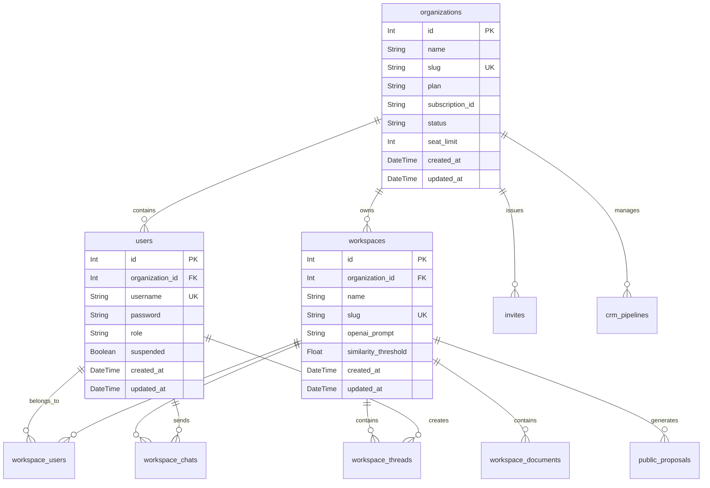

# Multi-Tenant SaaS Transformation Plan

## Overview

This plan outlines transforming AnythingLLM from a multi-user application into a multi-tenant SaaS platform with organization-based data isolation.

## Current State

- Multi-user mode with roles (admin, manager, default)
- JWT-based authentication
- Workspaces, documents, chat history
- No organization/tenant isolation - all data in shared database
- No billing/subscription system

## Target State

- Organizations as top-level tenants
- Each organization has isolated users, workspaces, documents
- Per-seat pricing model (to be implemented with payment provider later)
- Organization-level admin can manage their own users
- Platform-level admin can manage all organizations

---

## Architecture Diagram

---

## Database Schema Changes

### New Table: `organizations`

| Field | Type | Description |
|-------|------|-------------|
| id | Int (PK) | Primary key |
| name | String | Organization display name |
| slug | String (Unique) | URL-safe identifier |
| plan | String | Plan type: free, pro, enterprise |
| subscription_id | String? | Stripe subscription ID |
| status | String | active, trial, past_due, canceled |
| seat_limit | Int? | Max users allowed |
| settings | String? | JSON for organization settings |
| created_at | DateTime | Creation timestamp |
| updated_at | DateTime | Last update timestamp |

### Tables requiring `organization_id` FK:

1. **users** - Link user to organization
2. **workspaces** - Link workspace to organization
3. **invites** - Link invites to organization
4. **workspace_users** - Link to organization workspace
5. **workspace_documents** - Link to organization workspace
6. **workspace_chats** - Link to organization workspace
7. **workspace_threads** - Link to organization workspace
7. **workspace_agent_invocations** - Link to organization workspace
8. **crm_pipelines** - Link to organization
9. **crm_cards** - Link to organization pipeline
10. **public_proposals** - Link to organization workspace
11. **embed_configs** - Link to organization workspace
12. **embed_chats** - Link to organization embed config
13. **smart_plugins** - Link to organization workspace
14. **artifacts** - Link to organization workspace
15. **pdf_templates** - Link to organization (optional, user-owned)
16. **block_templates** - Link to organization workspace

---

## Implementation Steps

### Phase 1: Git Backup (Safety First)

1. Stage and commit all current changes
2. Push master branch to remote
3. Create backup branch `pre-saas-refactor`
4. Create feature branch `feature/multi-tenant-saas`

### Phase 2: Database Schema

1. Design `organizations` model with billing fields
2. Add `organization_id` FK to all relevant tables
3. Create Prisma migration
4. Run migration in development environment
5. Seed initial organization for existing data

### Phase 3: Backend Data Layer

1. Create `Organization` model in `server/models/organization.js`
2. Update `User` model to include organization relationship
3. Update `Workspace` model to include organization relationship
4. Create tenant isolation middleware
5. Update all database queries to filter by `organization_id`

### Phase 4: Authentication & Authorization

1. Update JWT tokens to include `organization_id`
2. Update authentication middleware to extract organization context
3. Add organization validation to user operations
4. Add seat limit checking during user creation

### Phase 5: Backend API Endpoints

1. Organization CRUD endpoints
2. User-to-organization assignment endpoints
3. Organization settings endpoints
4. Multi-tenant admin endpoints (platform-level)

### Phase 6: Frontend UI

1. Organization management page
2. Organization settings page
3. User assignment UI
4. Organization selector (if user belongs to multiple)
5. Plan/billing status display (placeholder for now)

### Phase 7: Tenant Isolation Verification

1. Test that users cannot access other organizations' data
2. Test workspace isolation
3. Test document isolation
4. Test chat history isolation

### Phase 8: Documentation & Deployment

1. Document architecture changes
2. Create migration guide for existing instances
3. Update deployment documentation

---

## Key Design Decisions

### 1. Organization Membership Model
- Each user belongs to exactly ONE organization (simpler)
- Future: Support multiple organizations per user (more complex)

### 2. Platform-Level Admin
- Super-admin role that can see all organizations
- Separate from organization admin role
- Useful for customer support and platform management

### 3. Seat Limit Enforcement
- Enforced at user creation time
- Checked during workspace user addition
- Displayed in organization settings

### 4. Backwards Compatibility
- Existing data needs to be migrated to a default organization
- Multi-user mode enabled instances get a default organization
- Queries with no organization context default to platform-level (for super-admin)

---

## Future SaaS Features (Not in Phase 1)

1. **Stripe Integration** - Subscription management
2. **Usage Tracking** - Messages, tokens, API calls
3. **Email Verification** - For user signup
4. **Self-Service Portal** - Plans, billing, invoices
5. **Webhook Events** - Subscription lifecycle events
6. **Trial System** - Free trial period with automatic conversion
7. **Custom Branding** - Per-organization white-labeling

---

## Risk Mitigation

1. **Data Loss** - Create backup branch before any schema changes
2. **Performance** - Add database indexes on `organization_id` columns
3. **Security** - Comprehensive testing of tenant isolation
4. **Migration** - Provide migration path for existing deployments

---

## Testing Strategy

1. Unit tests for Organization model
2. Integration tests for tenant isolation
3. E2E tests for organization management UI
4. Security tests for cross-tenant access attempts
